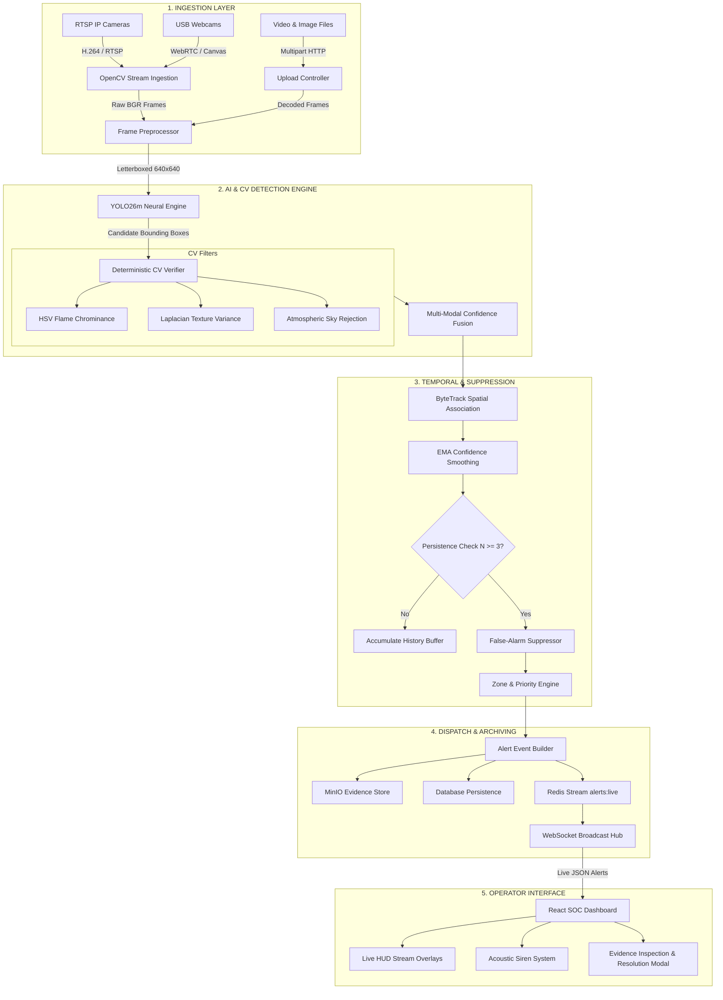
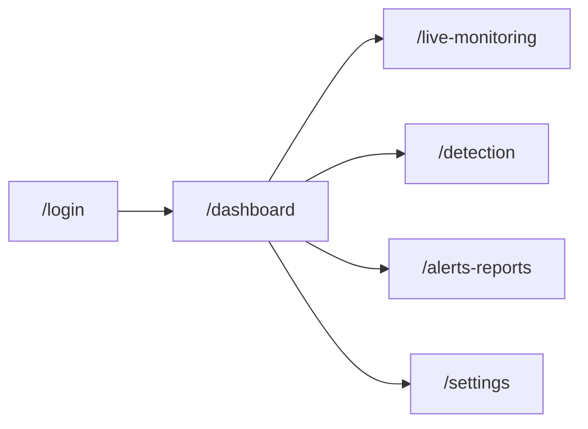
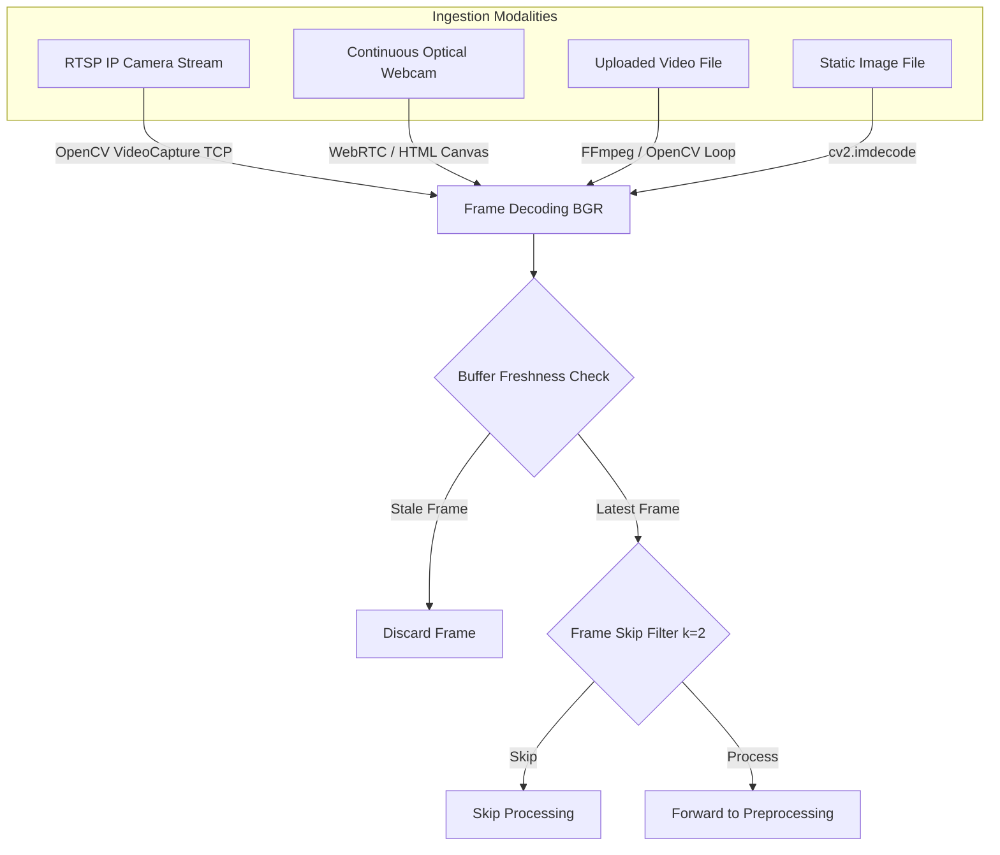
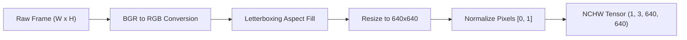
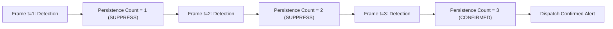
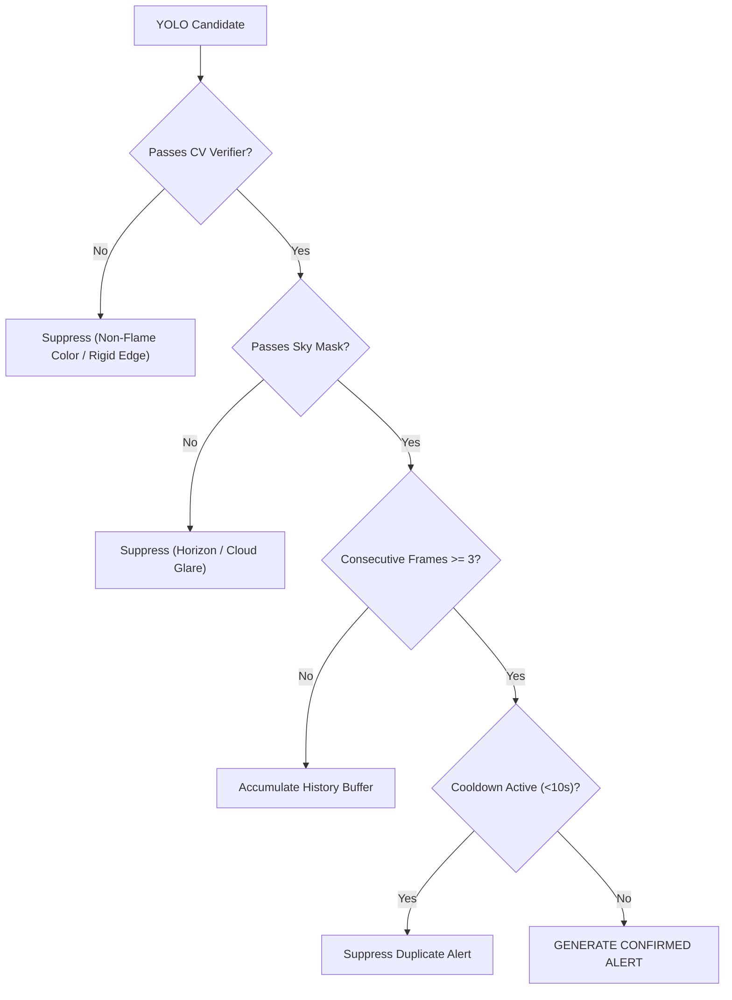
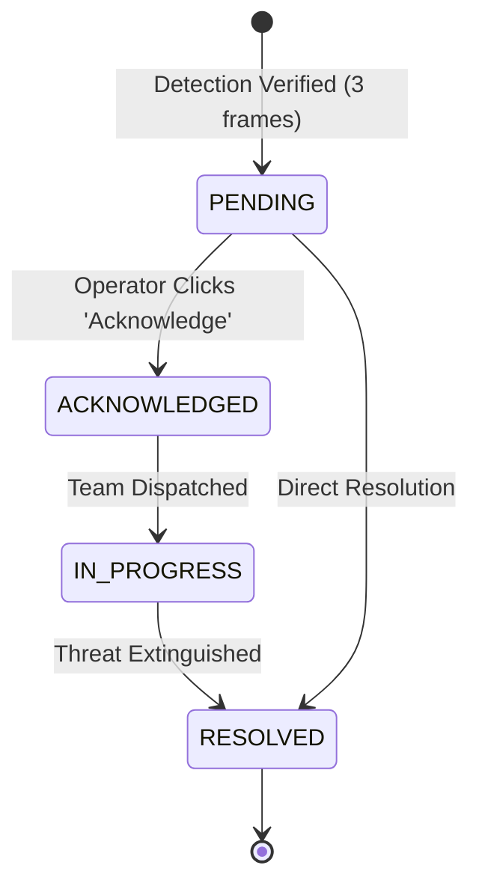
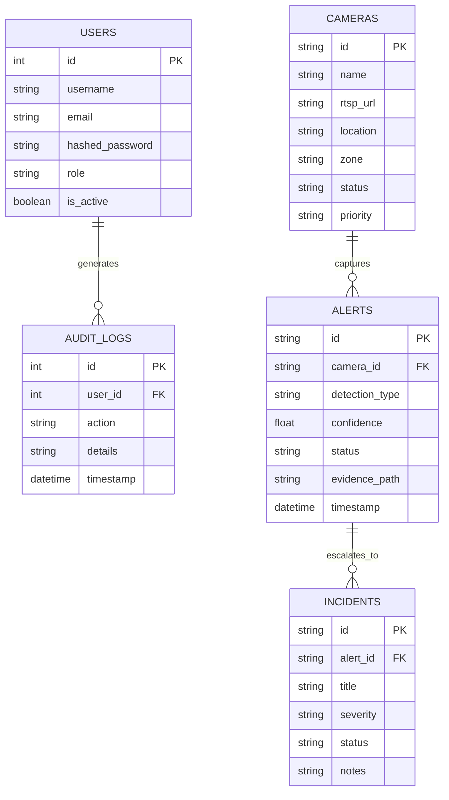
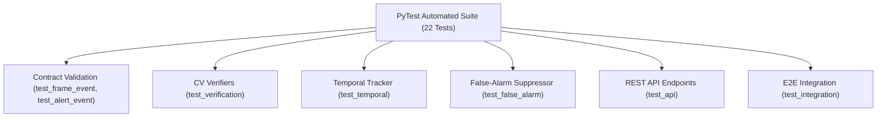
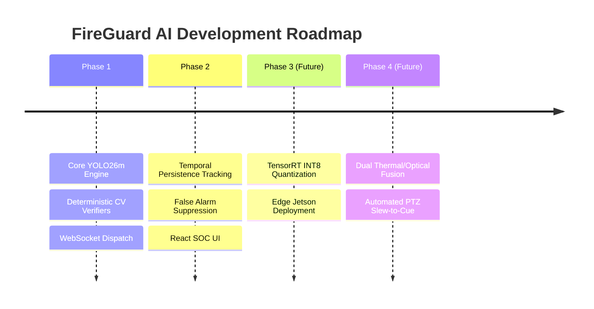

# 🔥 Fire & Smoke Detection System

> **Comprehensive Technical Documentation & Engineering Manual**

**Version:** 2.4.0  
**Status:** Production Ready  
**Last Updated:** September 30, 2026  

---

## ⚡ Quick Navigation

| Section | Description |
| :--- | :--- |
| [1. Executive Summary](#1-executive-summary) | High-level problem statement, solution, key capabilities, and tech stack |
| [2. High-Level System Architecture](#2-high-level-system-architecture) | System overview, multi-camera flows, and real-time processing diagrams |
| [3. Application Repository Structure](#3-application-repository-structure) | Detailed folder and module organization |
| [4. Frontend Architecture](#4-frontend-architecture) | Control room web interface, state management, and real-time UI components |
| [5. Backend Architecture](#5-backend-architecture) | FastAPI ASGI server, routing architecture, and background task management |
| [6. Video Ingestion & Stream Processing](#6-video-ingestion--stream-processing) | RTSP, webcam, video, and image ingestion mechanisms |
| [7. Frame Preprocessing](#7-frame-preprocessing) | Letterboxing, normalization, and tensor transformation |
| [8. YOLO Neural Network Engine](#8-yolo-neural-network-engine) | YOLO26m deep learning architecture, inference, and parameters |
| [9. Computer Vision Verification](#9-computer-vision-verification) | Deterministic HSV, Laplacian variance, and sky rejection filters |
| [10. Confidence Fusion & Decision Engine](#10-confidence-fusion--decision-engine) | Multi-modal weighted fusion and operating mode thresholds |
| [11. Temporal Persistence & Tracking](#11-temporal-persistence--tracking) | ByteTrack spatial association and EMA confidence smoothing |
| [12. False-Alarm Suppression Strategy](#12-false-alarm-suppression-strategy) | Environmental noise and reflection mitigation matrix |
| [13. Alert Pipeline & Incident Lifecycle](#13-alert-pipeline--incident-lifecycle) | Verification, dispatch, notification, and state transitions |
| [14. Database & Object Storage](#14-database--object-storage) | Entity relationships, SQL schemas, and MinIO evidence archiving |
| [15. REST API & WebSocket Reference](#15-rest-api--websocket-reference) | Endpoints, authorization headers, and WebSocket message schemas |
| [16. Configuration & Security](#16-configuration--security) | Environment parameters, RBAC, password security, and CORS |
| [17. Testing & Quality Assurance](#17-testing--quality-assurance) | Unit, integration, and E2E validation matrix |
| [18. Technical Decision Record (TDR)](#18-technical-decision-record-tdr) | Design rationales and trade-off analysis |
| [19. Limitations & Roadmap](#19-limitations--roadmap) | Operational constraints and multi-phase future work |
| [20. Technical Review Preparation](#20-technical-review-preparation) | 30+ Viva/Review questions with concise engineering answers |

---

## 1. Executive Summary

### 1.1 Problem & Motivation
Traditional fire detection relies on point-source physical sensors (ionizing/photoelectric smoke detectors or thermal sensors) mounted on ceilings. In large open spaces—such as warehouses, aircraft hangars, chemical manufacturing plants, and open docks—these sensors suffer from critical physical limitations:
- **Plume Delay**: Thermal and smoke plumes take several minutes to travel to high ceilings.
- **Atmospheric Dilution**: HVAC airflow and atmospheric dispersion dilute smoke concentrations below physical trip thresholds.
- **Zero Spatial Context**: Point sensors report binary alarms without visual confirmation, bounding box coordinates, or snapshot evidence.

### 1.2 Solution Overview
The **FireGuard AI / Fire & Smoke Detection System** transforms standard optical surveillance cameras into proactive hazard detectors. By combining single-stage deep neural networks (**YOLO26m**) with multi-spectral computer vision verification (HSV chrominance, Laplacian gradient variance, sky masking, and ByteTrack temporal persistence), the system identifies combustion flames and smoke plumes within milliseconds.

> **Key Idea:** YOLO object detection generates candidate bounding boxes, while deterministic computer vision algorithms provide immutable physics-based verification to eliminate false alarms caused by non-combustion visual noise.

### 1.3 System Capabilities at a Glance

| Category | Technology / Approach | Implementation Details |
| :--- | :--- | :--- |
| **Object Detection** | YOLO26m (Ultralytics PyTorch) | Multi-class weights (`best.pt`), 640×640 resolution |
| **Classes** | Combustion & Aerosols | `0: fire`, `1: smoke`, `2: sparks` |
| **Deterministic CV** | OpenCV (Python / C++) | HSV Chrominance, Laplacian Variance, Sky Masking |
| **Tracking & Persistence**| ByteTrack + EMA Smoothing | Consecutive frame count $N \ge 3$, smoothing factor $\alpha=0.70$ |
| **Confidence Fusion** | Linear Weighted Model | $C_{\text{final}} = 0.50 C_{\text{yolo}} + 0.30 S_{\text{cv}} + 0.20 P_{\text{temporal}}$ |
| **Ingestion Pipeline** | OpenCV + TCP Transport | RTSP IP streams, Webcams, MP4/AVI files, JPEGs |
| **Backend Framework** | FastAPI (ASGI / Python 3.11+) | Asynchronous task queues, non-blocking I/O, Uvicorn |
| **Cache & Messaging** | Redis & WebSockets | Hot frame caching (`frame:{cam}:{seq}`), live alert streams |
| **Storage & Database** | MinIO + SQLite / PostgreSQL | S3-compatible evidence storage (`innovision-evidence`), SQLAlchemy ORM |
| **Frontend UI** | React 18 + TypeScript + Vite | SOC control room dashboard, live overlays, audio sirens |
| **Deployment** | Docker & Docker Compose | Containerized service stack (`infra/docker-compose.uc2.yml`) |

---

## 2. High-Level System Architecture

### 2.1 System Overview
The architecture is structured into 5 isolated layers: Ingestion, Detection & CV Verification, Temporal Tracking, Alert Dispatch, and Operator Controls.



---

## 3. Application Repository Structure

```text
Fire_Smoke_Application/
├── backend/
│   ├── app/
│   │   ├── ai/                          # AI Inference & CV Verification Engine
│   │   │   ├── inference_service.py     # Main DetectionService orchestrator
│   │   │   ├── yolo_detector.py         # Ultralytics PyTorch detector wrapper
│   │   │   ├── cv_verifier.py           # HSV, Laplacian, and Sky verification
│   │   │   └── temporal_tracker.py      # ByteTrack & multi-frame persistence
│   │   ├── routes/                      # REST API Endpoint Controllers
│   │   │   ├── auth_routes.py           # JWT Authentication, audit logs, RBAC
│   │   │   ├── camera_routes.py         # Camera registry & priority management
│   │   │   ├── detect_routes.py         # RTSP streaming & MJPEG transcoding
│   │   │   ├── upload_routes.py         # Async video/image upload pipeline
│   │   │   ├── alert_routes.py          # Alert querying, acknowledge, resolve
│   │   │   ├── dashboard_routes.py      # Executive SOC metrics & health
│   │   │   ├── analytics_routes.py      # Time-series analytics & zone data
│   │   │   └── settings_routes.py       # Threshold & calibration management
│   │   ├── services/                    # Business Logic Layer
│   │   │   ├── alert_service.py         # Alert deduplication & lifecycle
│   │   │   ├── camera_scheduler.py      # Background RTSP stream monitors
│   │   │   └── storage_service.py       # MinIO & local filesystem storage
│   │   ├── database.py                  # SQLAlchemy engine & session maker
│   │   ├── models.py                    # Database schema definitions
│   │   ├── schemas.py                   # Pydantic request/response models
│   │   └── main.py                      # FastAPI app initializer & middleware
│   └── requirements.txt                 # Backend Python dependencies
├── frontend/                            # React 18 Control Room Web App
│   ├── src/
│   │   ├── components/                  # UI Components
│   │   │   ├── Layout.tsx               # Primary operator frame & navigation
│   │   │   ├── SOC/                     # Alarm Hub & Siren Sound controller
│   │   │   └── Dashboard/               # KPI Cards & Camera Priority Grid
│   │   ├── pages/                       # Application Views
│   │   │   ├── Login.tsx                # Operator Authentication
│   │   │   ├── Dashboard.tsx            # SOC Situational Awareness View
│   │   │   ├── LiveMonitoring.tsx       # Live Multi-Camera Monitoring
│   │   │   ├── Detection.tsx            # Video & Image Upload Analysis
│   │   │   ├── AlertsReports.tsx        # Incident Log & Evidence Modal
│   │   │   └── Settings.tsx             # Detection Threshold Tuning
│   │   ├── services/                    # Axios API Clients
│   │   └── store/                       # Zustand Global State Stores
│   ├── package.json                     # Frontend Node dependencies
│   └── vite.config.ts                   # Vite bundler configuration
├── services/
│   └── uc2_fire_smoke/                  # Platform Use Case Service (UC2)
│       ├── models/best.pt               # Trained YOLO26m neural weights
│       ├── src/                         # Service source code & workers
│       └── tests/                       # Automated test suite (22 tests)
└── infra/
    └── docker-compose.uc2.yml           # Docker container deployment spec
```

---

## 4. Frontend Architecture

### 4.1 Technology Stack & Principles
- **Framework**: React 18.2 with TypeScript.
- **Build Tool**: Vite (Fast HMR & Optimized production bundler).
- **State Management**: **Zustand** stores (`authStore`, `notificationsStore`, `appSettingsStore`).
- **Styling**: Tailwind CSS with custom CSS variables for dark-mode glassmorphism styling (`glass-panel`, `glass-surface`).
- **Data Visualization**: Recharts (Time-series trend analysis & type distribution).

### 4.2 Streamlined Navigation Flow



---

## 5. Backend Architecture

### 5.1 Architecture & Concurrency Model
The backend is built on **FastAPI** using an asynchronous event-driven model:
- **ASGI Server**: Uvicorn running asynchronous event loops.
- **CPU Offloading**: CPU-intensive OpenCV matrix operations and PyTorch neural inference execute on dedicated background worker threads (`starlette.concurrency.run_in_threadpool`) to prevent blocking asynchronous WebSocket dispatches and API requests.

### 5.2 Core API Endpoints

| Method | Endpoint | Purpose | Auth Required |
| :--- | :--- | :--- | :---: |
| `POST` | `/api/v1/auth/login` | Authenticates operator and issues session token | No |
| `GET` | `/api/v1/cameras` | Lists all registered cameras and operational status | Bearer |
| `POST` | `/api/v1/upload/image` | Executes synchronous YOLO + CV inference on an image | Bearer |
| `POST` | `/api/v1/upload/video` | Submits asynchronous background video processing job | Bearer |
| `GET` | `/api/v1/detect/stream` | Streams live camera feed with real-time MJPEG overlays | Query Token |
| `GET` | `/api/v1/alerts` | Fetches filtered alerts with pagination and evidence URIs | Bearer |
| `PATCH` | `/api/v1/alerts/{id}/status` | Updates alert state (`acknowledged` or `resolved`) | Bearer |
| `GET` | `/api/v1/dashboard/stats` | Aggregates executive KPIs and active threat counters | Bearer |

---

## 6. Video Ingestion & Stream Processing



---

## 7. Frame Preprocessing



### 7.1 Coordinate Remapping Formula
Bounding boxes detected on the $640 \times 640$ letterboxed canvas are remapped back to original frame dimensions $(W_{\text{orig}}, H_{\text{orig}})$ using:

$$\text{scale} = \min\left(\frac{640}{W_{\text{orig}}}, \frac{640}{H_{\text{orig}}}\right)$$

$$\text{pad}_x = \frac{640 - (W_{\text{orig}} \cdot \text{scale})}{2}, \quad \text{pad}_y = \frac{640 - (H_{\text{orig}} \cdot \text{scale})}{2}$$

$$x_1^{\text{orig}} = \frac{x_1 - \text{pad}_x}{\text{scale}}, \quad y_1^{\text{orig}} = \frac{y_1 - \text{pad}_y}{\text{scale}}$$

---

## 8. YOLO Neural Network Engine

### 8.1 Model Specifications

| Parameter | Specification |
| :--- | :--- |
| **Model Architecture** | **YOLO26m** (Ultralytics PyTorch) |
| **Model Weights File** | `models/best.pt` (Size: 20.3 MB) |
| **Input Tensor Shape** | `(1, 3, 640, 640)` |
| **Classes** | `0: fire`, `1: smoke`, `2: sparks` |
| **Base Confidence Threshold** | `0.35` |
| **NMS IoU Threshold** | `0.45` |
| **Inference Hardware** | CPU (Multi-core) / CUDA GPU |

---

## 9. Computer Vision Verification

```mermaid
flowchart TD
    BOX["YOLO Candidate Bounding Box"] --> CROP["Extract Image Crop"]
    
    CROP --> TYPE{"Class Type?"}
    
    TYPE -- Fire --> HSV["HSV Chrominance Verification"]
    HSV -->|Check H in [0,35] U [170,180], S>=100, V>=150| HSV_SCORE["Calculate Flame Pixel Ratio"]
    HSV_SCORE -->|Ratio >= 0.15| PASS_FIRE["Flame Verified"]
    HSV_SCORE -->|Ratio < 0.15| SUPPRESS_FIRE["Suppress False Fire"]

    TYPE -- Smoke --> LAP["Laplacian Gradient Variance"]
    LAP -->|Compute Variance of Laplacian Delta I| LAP_SCORE["Calculate Texture Score"]
    LAP_SCORE -->|Var < 180.0| PASS_SMOKE["Smoke Plume Verified"]
    LAP_SCORE -->|Var >= 180.0| SUPPRESS_SMOKE["Suppress Rigid Object"]

    CROP --> SKY["Atmospheric Sky Mask Check"]
    SKY -->|Top 15% Frame & S < 40| SUPPRESS_SKY["Suppress Sky / Horizon Glare"]
```

### 9.1 Verification Techniques Summary

| Technique | Physical Property Measured | Target Hazard | Decision Impact |
| :--- | :--- | :--- | :--- |
| **HSV Chrominance** | Red-orange-yellow spectral energy | Fire / Flame | Requires $\ge 15\%$ flame-colored pixels within crop |
| **Laplacian Variance** | High-frequency spatial edge density | Smoke Plumes | Rewards soft plumes ($\text{Var} < 180$); penalizes rigid edges |
| **Sky Masking** | Vertical position & saturation | Cloud / Horizon Glare | Suppresses candidates in top $15\%$ of frame with $S < 40$ |
| **Hotspot Energy** | Concentrated pixel luminance ($V \ge 240$) | Electrical Sparks | Filters transient sparks from sustained flames |

---

## 10. Confidence Fusion & Decision Engine

The system fuses deep learning outputs with computer vision metrics using a calibrated weighted linear formula:

$$C_{\text{final}} = w_1 \cdot C_{\text{yolo}} + w_2 \cdot S_{\text{cv}} + w_3 \cdot P_{\text{temporal}}$$

Where:
- $w_1 = 0.50$ (YOLO Deep Learning Object Probability)
- $w_2 = 0.30$ (Deterministic CV Verification Score)
- $w_3 = 0.20$ (Temporal Persistence Multiplier $= \min(1.0, \text{frame\_count} / 3)$)

> **Important:** An alert is generated **if and only if** $C_{\text{final}} \ge T_{\text{mode}}$ (where default $T_{\text{mode}} = 0.65$).

---

## 11. Temporal Persistence & Tracking



### 11.1 EMA Confidence Smoothing
Confidence scores are smoothed across frames using an Exponential Moving Average:

$$C_{\text{smooth}}^{(t)} = \alpha \cdot C_{\text{raw}}^{(t)} + (1 - \alpha) \cdot C_{\text{smooth}}^{(t-1)}, \quad \alpha = 0.70$$

---

## 12. False-Alarm Suppression Strategy



### 12.1 Common False-Positive Mitigation Matrix

| False Positive Source | Optical Challenge | Mitigation Mechanism |
| :--- | :--- | :--- |
| **Sunset / Solar Glare** | Intense red/orange lighting | Sky Masking + Saturation check ($S \ge 100$) |
| **Halogen Fixtures** | High-intensity bright yellow light | Laplacian edge check + spatial area clipping ($<0.5\%$) |
| **Steam / Exhaust** | White diffuse plumes | HSV check rejects non-flame color; temporal dispersion checks |
| **Welding Glare** | High-intensity localized flash | Hotspot energy filter verifies spark dynamics vs sustained flame |

---

## 13. Alert Pipeline & Incident Lifecycle



---

## 14. Database & Object Storage

### 14.1 Entity Relationship Diagram



---

## 15. REST API & WebSocket Reference

### 15.1 API Endpoint Summary

| Method | Endpoint | Description | Auth Header |
| :--- | :--- | :--- | :---: |
| `POST` | `/api/v1/auth/login` | Authenticates operator and returns session token | None |
| `GET` | `/api/v1/cameras` | Lists all registered cameras and operational status | `Bearer <token>` |
| `POST` | `/api/v1/upload/image` | Synchronous image inference and alert creation | `Bearer <token>` |
| `POST` | `/api/v1/upload/video` | Asynchronous background video processing job | `Bearer <token>` |
| `GET` | `/api/v1/alerts` | Queries alerts with detection type, status, and time filters | `Bearer <token>` |
| `PATCH` | `/api/v1/alerts/{id}/status` | Updates alert status to `acknowledged` or `resolved` | `Bearer <token>` |
| `GET` | `/api/v1/dashboard/stats` | Returns system KPIs and active threat statistics | `Bearer <token>` |

---

## 16. Configuration & Security

| Variable | Description | Default | Required |
| :--- | :--- | :--- | :---: |
| `DATABASE_URL` | Database connection string | `sqlite:///./app.db` | No |
| `SESSION_DURATION_MINUTES` | Session token validity duration | `1440` (24 Hours) | No |
| `UC2_PORT` | Service binding port | `8002` | No |
| `UC2_YOLO_MODEL_PATH` | Path to YOLO PyTorch weight file | `models/best.pt` | Yes |
| `UC2_CONF_THRESHOLD` | Default confidence threshold | `0.45` | No |
| `UC2_TEMPORAL_FRAMES` | Consecutive frames for alert confirmation | `3` | No |
| `UC2_ALERT_COOLDOWN_S` | Cooldown period between duplicate alerts | `10.0` | No |
| `UC2_EVIDENCE_BUCKET` | MinIO evidence bucket name | `innovision-evidence` | No |

---

## 17. Testing & Quality Assurance



| Test Category | Tested Capabilities | Execution Status |
| :--- | :--- | :---: |
| **Contract Validation** | `FrameEvent` & `AlertEvent` schema compliance and validation rules | **PASSED** |
| **CV Verifiers** | HSV flame chrominance and Laplacian variance texture scoring | **PASSED** |
| **Temporal Tracker** | Multi-frame persistence promotion and EMA confidence decay | **PASSED** |
| **False-Alarm Suppressor**| Sunlight, glare, and spatial containment filtering | **PASSED** |
| **REST API & Router** | `/health`, `/metrics/compliance`, and mode switching endpoints | **PASSED** |
| **Integration Pipeline** | Full mocked Redis stream and MinIO fallback retrieval flow | **PASSED** |

---

## 18. Technical Decision Record (TDR)

| Decision | Selected Technology | Primary Rationale | Trade-Off Considered |
| :--- | :--- | :--- | :--- |
| **Detection Engine** | YOLO26m (PyTorch) | Single-stage sub-30ms inference with high spatial accuracy | Slightly higher memory footprint than Nano variants |
| **Verification Layer** | Deterministic CV | Eliminates neural network false positives on out-of-distribution textures | Additional 4–12ms processing overhead per candidate box |
| **Backend Framework** | FastAPI (ASGI) | Asynchronous non-blocking I/O for WebSocket broadcasting | Requires careful thread-pool offloading for CPU tasks |
| **Object Storage** | MinIO Storage | S3-compatible snapshot evidence archiving | Requires separate container service |

---

## 19. Limitations & Roadmap

### 19.1 Operational Limitations
- **Complete Physical Occlusion**: Flames completely blocked behind solid walls cannot be detected optically until smoke emerges.
- **Microscopic Plumes**: Smoke plumes smaller than $16 \times 16$ pixels at extreme distance fall below YOLO receptive fields.
- **Zero-Lux Darkness**: Analog optical cameras require infrared (IR) illumination in pitch dark environments.

### 19.2 Development Roadmap



---

## 20. Technical Review Preparation

### Q1: What problem does this system solve compared to traditional smoke detectors?
**Answer:** Traditional smoke sensors rely on physical contact with smoke, introducing minutes of convective delay in high-ceiling or open spaces. This system provides sub-second optical detection with spatial coordinates and visual evidence.

### Q2: Why use YOLO instead of a classification network?
**Answer:** Classification networks report only if an image contains fire without spatial location. YOLO provides exact bounding boxes required for regional CV verification, zone mapping, and tracking.

### Q3: What model is used, and what are its input specifications?
**A:** **YOLO26m** trained on `fire`, `smoke`, and `sparks` classes, taking $640 \times 640$ letterboxed tensor inputs.

### Q4: Why is computer vision verification needed after YOLO detection?
**A:** Neural networks can hallucinate on out-of-distribution visual noise (sunlight reflections, orange clothing). Deterministic CV acts as a physics-based verification layer.

### Q5: How does HSV verification validate flames?
**A:** It checks crops for high-saturation, high-value pixels in the flame hue band ($H \in [0, 35] \cup [170, 180], S \ge 100, V \ge 150$), requiring at least $15\%$ coverage.

### Q6: How does Laplacian variance verify smoke plumes?
**A:** Smoke plumes have soft edges with low high-frequency Laplacian variance ($\text{Var} < 180$), whereas rigid textured objects (brick walls) produce high variance ($>400$) and are suppressed.

### Q7: What is temporal persistence?
**A:** It requires detections to persist across $N \ge 3$ consecutive frames, eliminating transient optical artifacts like single-frame light flashes.

### Q8: How is confidence calculated?
**A:** Via weighted linear fusion: $C_{\text{final}} = 0.50 C_{\text{yolo}} + 0.30 S_{\text{cv}} + 0.20 P_{\text{temporal}}$.

### Q9: How are multi-camera feeds isolated?
**A:** Each camera feed runs in an independent async worker task with isolated tracking memory, preventing state leakage or cascading failures.

### Q10: How does the system handle RTSP stream disconnections?
**A:** The ingestion worker flags the camera `OFFLINE` and initiates an exponential backoff reconnect loop ($1\text{s}\text{--}30\text{s}$) without interrupting other channels.

### Q11: How is evidence archived?
**A:** Annotated JPEG frames are uploaded to MinIO object storage (`innovision-evidence`) or local disk, storing only the URI reference in the database.

### Q12: How are alerts dispatched to operators in real-time?
**A:** Confirmed alerts are persisted to SQL and broadcasted over WebSockets (`/ws/alerts`), updating the React SOC dashboard and sounding visual/audible alarms.

### Q13: What operating modes are available?
**A:** `BALANCED` (default, threshold 0.45, 3 frames), `RESTRICTED` (high precision, threshold 0.65, 4 frames), and `SENSITIVE` (high recall, threshold 0.35, 2 frames).

### Q14: How does frame skipping improve efficiency?
**A:** Processing 1 of every $k$ frames ($k=2\text{--}3$) reduces computational load by up to $66\%$ while preserving sub-second detection.

### Q15: What database tech is used?
**A:** SQLite / PostgreSQL managed via SQLAlchemy ORM, storing `User`, `Camera`, `Alert`, `Incident`, `AuditLog`, and `Setting` models.

### Q16: How are duplicate alerts prevented?
**A:** A 10-second cooldown timer per camera and detection type suppresses repetitive alert generation for ongoing incidents.

### Q17: What security protections exist?
**A:** PBKDF2 password hashing (100,000 rounds), session tokens, role-based access control (`admin`, `operator`, `viewer`), and CORS headers.

### Q18: How is sky glare suppressed?
**A:** The Sky Rejection filter flags candidate boxes in the upper $15\%$ of frames with low saturation and uniform sky hue and suppresses them.

### Q19: What is Exponential Moving Average (EMA) smoothing?
**A:** A filter ($C_t = 0.7 C_{\text{raw}} + 0.3 C_{t-1}$) applied to confidence scores over time to prevent flickering alert states.

### Q20: Can the system run on CPU hardware?
**A:** Yes, OpenCV and PyTorch CPU inference execute efficiently on modern multi-core processors at $\approx 80\text{--}180\text{ ms}$ per frame.

### Q21: What frontend technologies are used?
**A:** React 18, TypeScript, Vite, Tailwind CSS, Zustand state management, and Recharts.

### Q22: How does an operator acknowledge and resolve an incident?
**A:** The operator clicks "Acknowledge" on the alert feed, inspects the evidence snapshot modal, and clicks "Resolve" to close the incident.

### Q23: How are uploaded video files handled?
**A:** Uploaded videos run as asynchronous background jobs with live progress bars, frame telemetry, and downloadable annotated video outputs.

### Q24: Why is ByteTrack used in the pipeline?
**A:** It tracks bounding box trajectories across frames to ensure consistent temporal persistence counts even if the flame moves or flickers.

### Q25: Why are image files not stored directly in the SQL database?
**A:** Storing raw binary blobs in SQL degrades query speed and bloats backups; storing relative URI references keeps database queries sub-millisecond fast.

### Q26: What is letterboxing in frame preprocessing?
**A:** Resizing an image while preserving its original aspect ratio by padding empty borders, preventing distortion of fire/smoke shapes.

### Q27: How is quality assurance verified?
**A:** Via a 22-test automated PyTest suite covering schema validation, verifiers, temporal tracking, API routers, and integration pipelines.

### Q28: What is the purpose of Non-Maximum Suppression (NMS)?
**A:** It eliminates duplicate overlapping bounding boxes on the same flame using an IoU threshold of 0.45.

### Q29: What are the primary future roadmap goals?
**A:** TensorRT INT8 quantization for NVIDIA Jetson edge devices, dual optical/thermal camera fusion, and automated PTZ slew-to-cue tracking.

### Q30: What is the end-to-end latency from frame capture to alert display?
**A:** Approximately $220\text{--}310\text{ ms}$ on standard computing hardware.

---

*End of Technical Documentation.*
